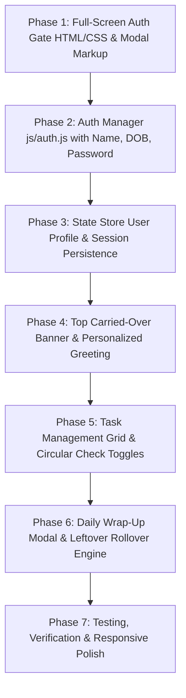

# Agent Implementation Guide (`agent.md`)
# Project: LifeFlow / VITALITY — Integrated Task & Physical Activity Web App

> **Source PRD**: [PRD.md](file:///c:/Users/karsh/Desktop/project/PRD.md)  
> **Source Design System**: [DESIGN.md](file:///c:/Users/karsh/Desktop/project/DESIGN.md)  
> **Target Stack**: Semantic HTML5, Modern CSS3 (Custom Properties, Grid/Flexbox, Glassmorphism, Responsive), Vanilla ES6+ JavaScript (LocalStorage, Web Notifications, SVG Charts).  
> **App Architecture**: Client-Side Single Page Application (SPA) / Modular Component Architecture.

---

## 1. Agent Mission & Persona

You are an expert Frontend Architect and UI/UX Engineer agent tasked with implementing **LifeFlow / VITALITY**, a unified productivity, authentication, and physical activity tracking application based on the requirements defined in `PRD.md` and `DESIGN.md`.

### Primary Directives:
1. **Faithfulness to PRD & Reference Designs**: Implement all core pillars:
   - **Feature 0: User Authentication & Profile Onboarding**: Full-screen gate asking for **Full Name**, **Date of Birth**, and **Password** (with show/hide toggle), calculating age for wellness personalization, persisting session, and providing Logout.
   - **Feature 1: Intelligent Task Management**: Categorized columns (`💼 Work`, `🏠 Personal`, `🏋️ Fitness`) and Timeline views with priorities ($P1-P4$), overdue alerts, subtasks progress trays, and circular check toggles.
   - **Feature 2: Physical Activity Planner & Real-Time Trackers**: Workouts, step goals, active minutes, and movement nudges.
   - **Feature 3: Smart Reminders & Leftover Alerts**: Sticky carried-over banner ("⚠️ 2 tasks carried over from yesterday"), overdue toasts, and snooze/reschedule controls.
   - **Feature 4: End-of-Day (EoD) Status & Daily Wrap-Up**: Automated and manual trigger modal with 4-box scorecard, feeling emoji selector (`😴`, `😐`, `🙂`, `🤩`, `🔥`), leftover bulk roll-over engine, and reflection notes.
2. **Visual Excellence (HTML/CSS)**: Dark velvet plum (`#120711`/`#1a0b18`) and baby pink (`#fbcfe8`/`#f472b6`) aesthetic with precision $1\text{px}$ hairline borders, glowing accents, *Playwrite DE LA Guides* cursive typography, and fluid micro-interactions.
3. **Zero-Dependency & Standalone**: Pure vanilla HTML5, CSS3, and JavaScript, leveraging browser `localStorage` for offline persistence.

---

## 2. Project File & Directory Structure

```
project/
├── PRD.md                        # Master Product Requirements Document (v1.1.0)
├── DESIGN.md                     # Design System & UI/UX Guidelines
├── AGENTS.md                     # Agent blueprint & execution instructions (this file)
├── index.html                    # Single Page App markup & semantic containers
├── css/
│   ├── variables.css             # Design tokens, color palette, dark/baby pink themes, typography
│   ├── base.css                  # Modern reset, base styles, scrollbars, utility classes
│   ├── layout.css                # App shell, responsive grid, sidebar navigation, header
│   ├── components.css            # Auth cards, task cards, scorecards, feeling emojis, toasts
│   └── animations.css            # Keyframe animations, bounce checks, celebration effects
└── js/
    ├── app.js                    # Entry point, tab routing, event listeners
    ├── store.js                  # State store with LocalStorage persistence & user profile
    ├── auth.js                   # Authentication & onboarding manager (Name, DOB, Password)
    ├── tasks.js                  # Task CRUD, filters, priority tagging, subtask handling
    ├── activity.js               # Workout planning, step counter, active timer, movement alerts
    ├── reminders.js              # In-app notification engine, leftover item detector, toast banners
    └── eod-summary.js            # End-of-Day modal, daily scorecard calculator, roll-over logic
```

---

## 3. UI/UX Design System Specifications

### 3.1 Color Palette & Theme Tokens (`css/variables.css`)

```css
:root {
  /* Background Layers (Dark Velvet & Obsidian Plum) */
  --bg-app: #120711;                 /* Base canvas */
  --bg-surface: #1a0b18;             /* Cards, panels */
  --bg-surface-elevated: #261023;    /* Modals, elevated cards */
  --bg-input: #170916;               /* Inputs */

  /* Brand & Accents (Baby Pink & Rose) */
  --baby-pink: #fbcfe8;              /* Soft pastel baby pink */
  --baby-pink-light: #fdf2f8;        /* Bright blush white */
  --pink-accent: #f472b6;            /* Neon Rose */
  --pink-gradient: linear-gradient(135deg, #f472b6 0%, #db2777 100%);
  
  /* Priority Color Codes */
  --priority-p1: #fb7185;            /* P1 Urgent: Coral Rose */
  --priority-p2: #f472b6;            /* P2 High: Pink */
  --priority-p3: #c084fc;            /* P3 Medium: Orchid */
  --priority-p4: #94a3b8;            /* P4 Low: Slate */

  /* Thin Borders & Radii */
  --border-subtle: 1px solid rgba(251, 207, 232, 0.12);
  --border-card: 1px solid rgba(251, 207, 232, 0.14);
  --border-focus: 1px solid #f472b6;
  --radius-sm: 8px;
  --radius-md: 14px;
  --radius-xl: 24px;
}
```

### 3.2 Typography & Iconography
- **Sans-Serif Font Stack**: `Inter`, system-ui, -apple-system, sans-serif.
- **Handwritten / Cursive Font**: `Playwrite DE LA Guides`, cursive.
- **Icons**: Clean inline SVG icons for actions (Check, Clock, Flame, Dumbbell, Bell, Calendar, Lock, Eye).

---

## 4. Component & Feature Implementation Details

### Feature 0: User Authentication & Profile Onboarding (`js/auth.js` & `css/components.css`)
- **Mandatory Full-Screen Auth Gate (`#auth-screen`)**:
  - Gated view displayed by default when `user.isAuthenticated === false`.
  - Main personal dashboard (`#app-main-view`) is hidden until valid sign-up or login occurs.
  - Brand header with cursive title in *Playwrite DE LA Guides*.
  - Tab Switcher: `[Sign Up]` and `[Log In]`.
  - **Sign Up Form Fields**:
    1. **Full Name** (`<input type="text">`): Personalizes dashboard greeting ("*Good morning, [Name].*").
    2. **Date of Birth** (`<input type="date">`): Auto-computes age for fitness and step pacing targets.
    3. **Password** (`<input type="password">`): Minimum 6 characters with show/hide eye toggle button.
  - **Log In Form Fields**: Full Name + Password.
  - **Session Management**: Upon successful sign-up or login, sets `isAuthenticated = true`, unlocks the dashboard, and persists session in `localStorage`. Provides a Logout/Lock action in the profile menu.

---

### Feature 1: Intelligent To-Do List Engine (`js/tasks.js` & `css/components.css`)
- **Categorized Columns**: 3-column responsive grid (`💼 Work`, `🏠 Personal`, `🏋️ Fitness`).
- **Task Cards**: Left vertical color strip, `OVERDUE` pill tag, priority badge, expandable subtasks checklist with progress bar, due date status, and circular check toggle.
- **Quick-Add Input Bar**: Top input bar supporting instant hashtag categorization (`#work`, `#personal`, `#fitness`, `#home`).

---

### Feature 2: Smart Reminders & Carried-Over Banner (`js/reminders.js`)
- **Carried-Over Alert Bar**: Sticky top yellow notification (`⚠️ 2 tasks carried over from yesterday [Review]`).
- **Floating Interactive Toasts**: Timed popups for task completions, overdues, and streak updates.

---

### Feature 3: End-of-Day (EoD) Status & Daily Wrap-Up (`js/eod-summary.js`)
- **Modal Component (`#eod-modal`)**:
  - Cursive header in *Playwrite DE LA Guides*.
  - 4 Scorecard boxes (`Tasks 12/15`, `Steps 8,420`, `Active Time 45m`, `Focus Hours 3.5h`).
  - 5 Feeling emojis (`😴`, `😐`, `🙂`, `🤩`, `🔥`) with glowing selection ring.
  - Leftover tasks list with `⤳ Move all remaining to tomorrow` one-click rollover button.
  - Quick Notes textarea with `Save Draft` and `✓ Finish Day` actions.

---

## 5. State Management & Data Schema (`js/store.js`)

```javascript
const InitialState = {
  user: {
    name: "",
    dateOfBirth: "",
    calculatedAge: 0,
    password: "",
    isAuthenticated: false // False by default; requires Sign-Up / Log-In
  },
  settings: {
    userName: "Alex",
    streakDays: 7,
    dailyStepGoal: 10000,
    dailyActiveMinGoal: 45,
    dailyFocusHoursGoal: 4.0,
    eodTriggerTime: "20:00"
  },
  metricsToday: {
    steps: 8420,
    activeMinutes: 45,
    focusHours: 3.5,
    tasksGoal: 15
  },
  tasks: [ /* Seeded tasks */ ],
  dailyHistory: []
};
```

---

## 6. Step-by-Step Implementation Roadmap for the Agent



---

## 7. Quality Checklist for Agent Execution

- [x] Semantic HTML5 structure with accessible inputs and labels.
- [x] Full-Screen Auth Gate with Name, Date of Birth, and Password validation.
- [x] Session persistence and Logout/Lock functionality in `localStorage`.
- [x] Dark velvet plum & baby pink styling with 1px thin borders.
- [x] *Playwrite DE LA Guides* font integrated for brand headings and wrap-up titles.
- [x] Carried-over reminder banner and End-of-Day modal matching reference designs.
