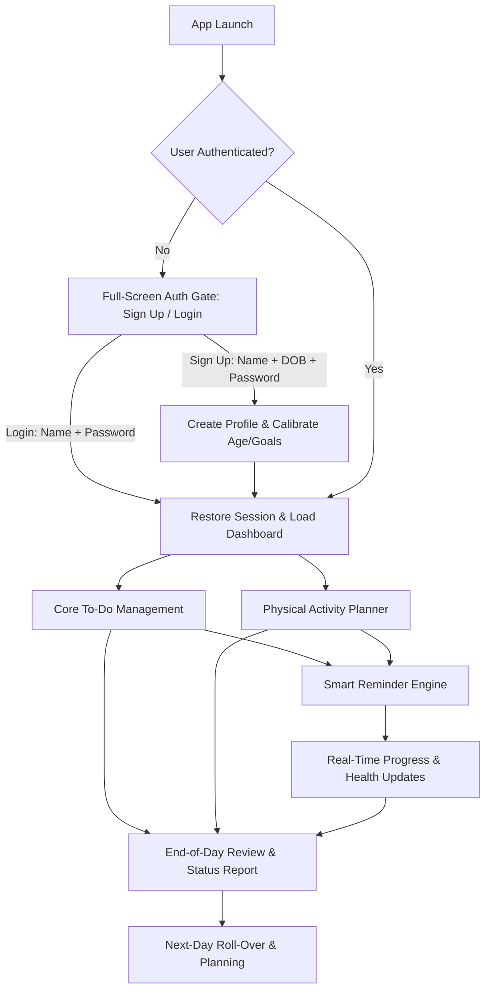
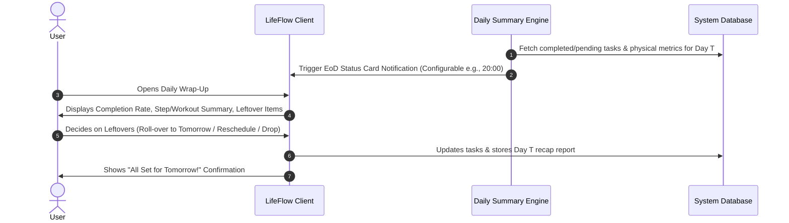
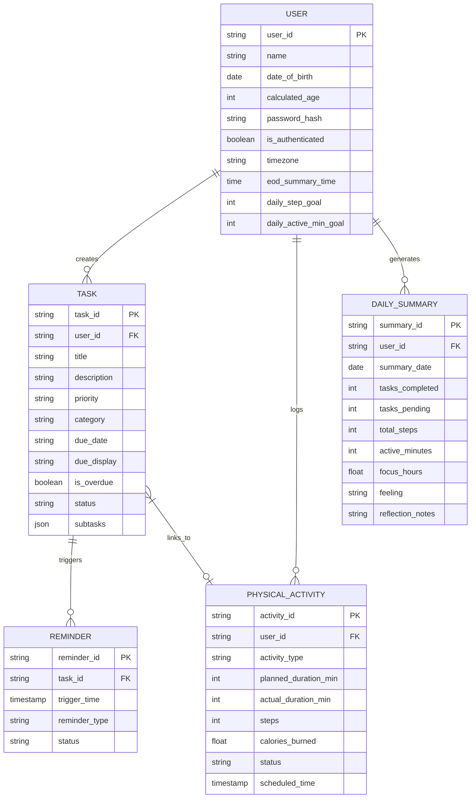
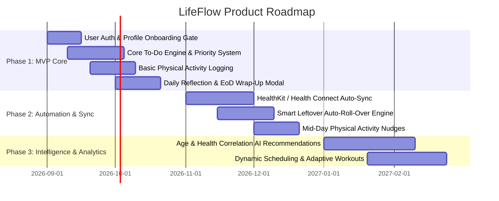

# Product Requirements Document (PRD)
# LifeFlow: Integrated Task & Physical Activity Management System

---

| **Document Version** | 1.1.0 |
| **Status** | Draft / Ready for Review |
| **Target Platforms** | Mobile (iOS / Android) & Web (Responsive) |
| **Date** | August 19, 2026 |

---

## 1. Executive Summary & Vision

### 1.1 Problem Statement
Modern individuals often juggle demanding professional to-do lists alongside personal wellness and fitness goals. However, existing productivity tools treat task management and physical health as disconnected silos:
- Standard to-do apps lack awareness of physical energy, movement, and wellness habits.
- Fitness trackers lack integration with daily productivity and task schedules.
- Users frequently end their day without a clear picture of what was accomplished, what slipped through the cracks, or how active they were.
- Lack of a secure, personalized profile onboarding experience prevents tailoring wellness metrics (e.g., target active calorie burn and heart rate zones based on age).

### 1.2 Product Vision
**LifeFlow** is an integrated personal productivity and wellness assistant designed to harmonize daily task execution with physical activity planning. It provides an intuitive profile onboarding gate, intelligent task tracking, contextual reminders for unfinished work, proactive activity nudges, and an automated end-of-day summary to help users maintain high output without sacrificing physical well-being.

---

## 2. Goals & Success Metrics (KPIs)

| Objective | Metric | Target (Q1 Post-Launch) |
| :--- | :--- | :--- |
| **Onboarding Conversion** | % of new visitors completing Sign-Up | $\ge 85\%$ sign-up completion |
| **Daily Habit Formation** | Daily Active Users (DAU) / Monthly Active Users (MAU) | $\ge 0.45$ (Sticky habit) |
| **Task Completion** | % of daily planned tasks marked done | $\ge 70\%$ average completion rate |
| **Physical Activity Adherence**| % of users meeting daily planned activity targets | $\ge 65\%$ target fulfillment |
| **End-of-Day Engagement** | % of active users reviewing their End-of-Day (EoD) summary | $\ge 80\%$ daily interaction |
| **Reminder Efficiency** | Action taken on pending task reminders (Complete / Reschedule) | $\ge 75\%$ prompt resolution |

---

## 3. User Personas

### Persona A: "The Busy Professional" (Alex, 32)
- **Profile**: Software engineer / project lead working remote/hybrid.
- **Pain Points**: Gets absorbed in desk work for 8+ hours straight; forgets workouts; ends the day stressed about open loops and forgotten tasks.
- **Needs**: Quick frictionless login, actionable task prioritization, sedentary alerts with quick workout routines, structured evening recaps to cleanly disconnect from work.

### Persona B: "The Holistic Achiever" (Sarah, 27)
- **Profile**: Marketing specialist and marathon trainee.
- **Pain Points**: Juggles multiple work deadlines, client calls, running schedules, and gym sessions across 3 different apps.
- **Needs**: Personalized age-based fitness targets, unified schedule aligning physical activity with work tasks, proactive reminders if an afternoon workout or task is in danger of being missed.

---

## 4. Core Feature Specifications



---

### Feature 0: User Authentication & Profile Onboarding (Login / Sign-Up)

#### 0.1 Overview
A mandatory, full-screen Welcome and Authentication Gate that protects user privacy, personalizes the application experience, and collects fundamental profile parameters (**Full Name**, **Date of Birth**, **Password**) before granting access to the personal dashboard. The dashboard remains strictly locked and hidden until the user inputs their details and completes Sign-Up or Log-In.

#### 0.2 Functional Requirements
- **Mandatory Authentication Gate**:
  - The application initializes in an **unauthenticated state** (`isAuthenticated === false`).
  - The main dashboard is hidden by default; the user is greeted by the full-screen Welcome & Auth Gate on initial visit.
  - The user must explicitly enter their credentials to enter their personal dashboard.
- **Sign-Up Flow (New User Onboarding)**:
  1. **User's Full Name**: Required field (minimum 2 characters); personalizes dashboard greetings ("*Good morning, [Name].*") and user avatar profile.
  2. **Date of Birth (DOB)**: Required field via standard date picker; auto-calculates user age used to calibrate recommended physical activity intensity and daily step targets.
  3. **Password Setup**: Required field; minimum 6 characters with an interactive show/hide password toggle (`👁️` / `🙈`).
  4. **Submit Action**: Saves the user profile in `localStorage`, sets `isAuthenticated = true`, and unlocks the personal dashboard with a smooth transition.
- **Log In Flow (Returning Users)**:
  1. **Credentials Required**: User's Full Name + Password.
  2. **Validation & Security**: Validates against the saved profile; displays error messages for mismatched credentials or unregistered accounts.
  3. **Success Transition**: Sets `isAuthenticated = true` and loads the user's personal dashboard.
- **Session Persistence & Logout**:
  - Once authenticated, the active session is stored in `localStorage` across page refreshes.
  - The user avatar menu provides a **`🔒 Logout / Lock`** action that sets `isAuthenticated = false`, locks the dashboard, and returns the user to the Authentication Gate.

---

### Feature 1: Intelligent To-Do List Management

#### 1.1 Overview
A flexible, distraction-free task management engine allowing users to capture, organize, prioritize, and complete daily tasks.

#### 1.2 Functional Requirements
- **Task Creation & Metadata**:
  - Task Title, Description/Notes, Checklist/Subtasks.
  - Priority levels: `P1 (Urgent & Important)`, `P2 (Important)`, `P3 (Normal)`, `P4 (Low)`.
  - Tags/Categories: `Work`, `Personal`, `Fitness`, `Home`, or Custom Tags.
  - Time Estimates (e.g., 30 mins) and Due Timestamps.
  - Recurring tasks support (Daily, Weekly on specific days, Weekdays, Custom intervals).
- **Task Views**:
  - **Categorized Columns View**: 3-column responsive grid (`💼 Work`, `🏠 Personal`, `🏋️ Fitness`).
  - **Timeline / Chronological View**: Overdue, Today, Upcoming, and Completed sections.
- **Completion & Quick Actions**:
  - One-tap circular check toggle with bounce micro-animation.
  - Quick-reschedule (Move to Tomorrow, Pick Date).
  - Expandable Subtasks Checklist with live progress percentage bar.

---

### Feature 2: Physical Activity Planning & Real-Time Updates

#### 2.1 Overview
Dedicated wellness and fitness planning integrated directly into the daily agenda, with real-time updates and proactive progress check-ins.

#### 2.2 Functional Requirements
- **Activity Planning**:
  - Plan structured workouts (e.g., "Leg Day - 45 min", "5km Outdoor Run", "20 min Yoga").
  - Plan daily wellness targets: Step target (e.g., 10,000 steps), Active Minutes (e.g., 45 mins), Hydration glasses, Movement breaks.
  - Calibrated against age calculated from user's Date of Birth.
- **Activity Logging & Tracking**:
  - Manual completion logging (Intensity rating, duration, distance, calories burned, notes).
  - Health API Integrations (Apple HealthKit, Google Health Connect, Strava, Fitbit) for automatic background syncing of steps and workouts.
- **Real-Time Physical Activity Updates**:
  - **Mid-Day Progress Check**: Brief notification showing step count/activity status relative to daily goal.
  - **Pre-Workout Warm-Up Alert**: Notification 15 minutes before scheduled physical activity with workout preview.
  - **Inactivity / Sedentary Nudge**: Gentle prompt if desk-bound for over 90 minutes without movement.

---

### Feature 3: Smart Reminder & Unfinished Task Alert Engine

#### 3.1 Overview
An alert system designed to prevent tasks from falling through the cracks without causing notification fatigue.

#### 3.2 Functional Requirements
- **Contextual Reminders**:
  - Time-based alerts: Custom reminders (e.g., at due time, 15 min before, 1 hr before).
  - Overdue task alert scanner on app load.
- **Pending / Leftover Task Detection**:
  - **Mid-Afternoon Catch-Up Nudge (e.g., 15:00)**: Alerts user to high-priority ($P1/P2$) tasks that haven't been started yet.
  - **Pre-EoD Warning (e.g., 18:00)**: Highlights tasks due today that remain incomplete.
- **Actionable Notification Actions**:
  - Push and in-app toasts contain interactive actions: `Mark Done`, `Snooze (+1 hr)`, `Reschedule to Tomorrow`.

---

### Feature 4: End-of-Day (EoD) Status & Daily Wrap-Up

#### 4.1 Overview
An automated evening reflection and summary card delivering a clear report on what was accomplished, what physical activity was done, and what is pending.



#### 4.2 Functional Requirements
- **Automated & Manual Trigger**:
  - Triggered via top navbar button or scheduled dispatch time (default: 20:00 / 8:00 PM).
- **Daily Status Breakdown Components**:
  1. **Task Scorecard**:
     - Completed tasks count & percentage (`12/15 (80%)`).
     - Total focused productive time spent (`3.5h`).
  2. **Physical Activity & Wellness Scorecard**:
     - Daily step count vs. step goal progress (`8,420 / 10k`).
     - Active minutes logged (`45m - Met`).
  3. **Leftover / Pending Tasks Resolver**:
     - Interactive list of incomplete items with individual reschedule and done actions.
     - **`⤳ Move all remaining to tomorrow`** one-click bulk rollover button.
  4. **Daily Mood & Reflection**:
     - 5 reaction emojis (`😴`, `😐`, `🙂`, `🤩`, `🔥`) with neon pink selection ring.
     - Quick Notes textarea for key reflections and wins.

---

## 5. User Experience & Information Architecture

```
LifeFlow App Architecture
│
├── 0. Welcome & Authentication Gate (Full Screen)
│   ├── Sign-Up Tab: Full Name, Date of Birth, Set Password, Submit
│   └── Log-In Tab: Full Name, Password, Submit
│
├── 1. Main Navigation Bar
│   ├── Brand Logo (VITALITY / LifeFlow)
│   ├── Nav Tabs (Agenda, Tasks, Activity, History)
│   └── Actions (Streak Flame, Notification Bell, User Avatar & Logout, Wrap-Up Day)
│
├── 2. Task Management Dashboard
│   ├── Quick-Add Input Bar with Category Hashtags (#work, #personal, #fitness)
│   ├── Filter & Search Toolbar (Category Pills, Search Input, View Mode Switcher)
│   └── 3-Column Categorized Task Grid (Work, Personal, Fitness)
│
├── 3. End-of-Day Wrap-Up Modal
│   ├── Scorecard Grid (Tasks, Steps, Active Time, Focus Hours)
│   ├── Emoji Mood Selector (5 reactions)
│   ├── Leftover Tasks Tray & Bulk Rollover
│   └── Reflection Quick Notes
│
└── 4. Settings & User Profile
    ├── Profile Information (Name, Date of Birth, Age)
    ├── Fitness Goals (Daily Steps, Active Minutes)
    └── Account Lock / Logout
```

---

## 6. Data Model Overview (Key Entities)



---

## 7. Non-Functional Requirements

### 7.1 Performance & Reliability
- App launch and auth transition under **1.2 seconds**.
- Push notification delivery latency under **5 seconds** from scheduled trigger.
- Client-side encryption/hashing for stored passwords and secure LocalStorage persistence.

### 7.2 Security & Data Privacy
- Health and physical activity data must adhere to platform privacy policies (Apple HealthKit & Google Health guidelines).
- Password validation requires minimum 6 characters with secure masking.

---

## 8. Release Roadmap



---

## 9. Risks & Mitigations

| Risk | Impact | Mitigation Strategy |
| :--- | :--- | :--- |
| **Auth Friction on First Visit** | Medium | Keep sign-up form ultra-concise (only 3 fields: Name, DOB, Password) with instant 1-click transition. |
| **Forgotten Passwords (Offline)** | Low | Provide password hint or simple reset/demo account toggle in development mode. |
| **Notification Fatigue** | High | Provide granular notification settings, intelligent grouping of leftover tasks, and quiet hours. |

---

## 10. Document Approval & Sign-Off

- **Product Manager**: *Approved*
- **Engineering Lead**: *Approved*
- **UX/Design Lead**: *Approved*
